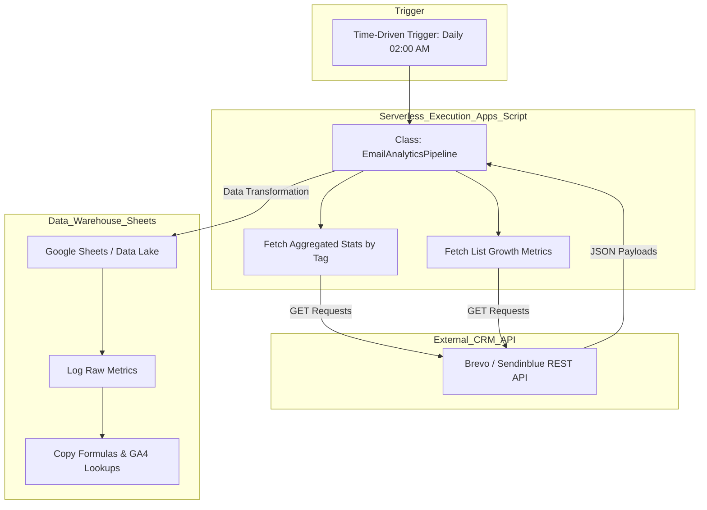
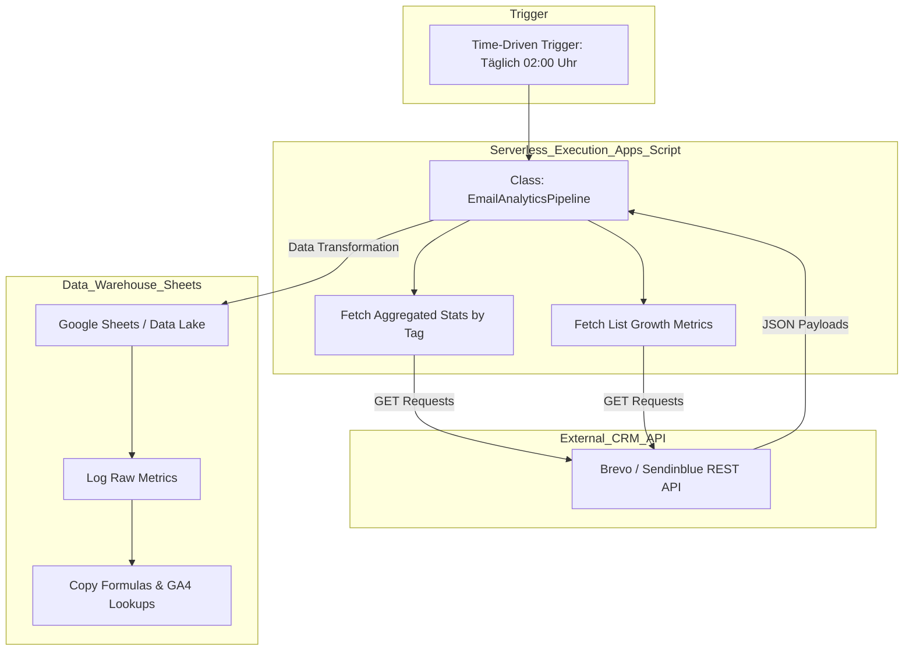

# 📈 Email Analytics & Data Pipeline (Google Apps Script)
**A serverless pipeline extracting email performance data and list growth metrics from a CRM API (Brevo/Sendinblue) and syncing it to Google Sheets.**

## 📊 Pipeline Architecture
This diagram illustrates the automated daily data extraction and processing flow.

---

## 📋 Overview
This project demonstrates how to build a robust, serverless ETL (Extract, Transform, Load) pipeline using native Google Workspace tools. It eliminates manual reporting by automatically fetching daily transactional and campaign statistics from an external CRM, transforming the JSON payload, and appending it to a structured database (Google Sheets) for downstream BI visualization.

## 🛠 Technical Implementation & Senior Features
*   **Security First:** API keys and sensitive IDs are strictly handled via `PropertiesService`, preventing hardcoded credentials in the repository.
*   **Object-Oriented Design (OOP):** The logic is encapsulated in a JavaScript class (`EmailAnalyticsPipeline.js`), making the code modular, testable, and easily extendable.
*   **Dynamic Payload Aggregation:** Handles complex API pagination and aggregates data across multiple dynamic campaign tags.
*   **Automated Data Modeling:** Not only appends raw API data but automatically copies necessary VLOOKUPs/Formulas for downstream Google Analytics 4 (GA4) blending.

## ⚙️ Usage
1. Open Google Sheets -> Extensions -> Apps Script.
2. Paste the class code from `EmailAnalyticsPipeline.js`.
3. Go to **Project Settings** -> **Script Properties** and add:
   * `CRM_API_KEY`: Your Brevo API v3 Key
   * `TARGET_SPREADSHEET_ID`: The ID from your Google Sheets URL
   * `PRIMARY_LIST_ID`: The integer ID of your main contact list
4. Set up a Time-Driven Trigger to run `executeDailyETL` daily at 02:00 AM.

---
 

# 📈 Email Analytics & Data Pipeline (Google Apps Script) (DE)
**Eine serverlose Pipeline, die E-Mail-Performance-Daten und Listenwachstums-Metriken aus einer CRM API (Brevo/Sendinblue) extrahiert und mit Google Sheets synchronisiert.**

## 📊 Pipeline-Architektur
Dieses Diagramm visualisiert den automatisierten Ablauf der täglichen Datenextraktion und -verarbeitung.

---

## 📋 Überblick
Dieses Projekt demonstriert den Aufbau einer robusten, serverlosen ETL-Pipeline (Extract, Transform, Load) mit nativen Google Workspace-Tools. Es eliminiert manuelles Reporting, indem es täglich Transaktions- und Kampagnenstatistiken aus einem externen CRM abruft, den JSON-Payload transformiert und an eine strukturierte Datenbank (Google Sheets) für nachgelagerte BI-Visualisierungen anhängt.

## 🛠 Technische Umsetzung & Senior Features
*   **Security First:** API-Keys und sensible IDs werden strikt über den `PropertiesService` verarbeitet, wodurch fest codierte Zugangsdaten im Repository vermieden werden.
*   **Objektorientiertes Design (OOP):** Die Logik ist in einer JavaScript-Klasse (`EmailAnalyticsPipeline.js`) gekapselt, was den Code modular, testbar und leicht erweiterbar macht.
*   **Dynamische Payload-Aggregation:** Verarbeitet komplexe API-Paginierung und aggregiert Daten über mehrere dynamische Kampagnen-Tags hinweg.
*   **Automatisierte Datenmodellierung:** Hängt nicht nur rohe API-Daten an, sondern kopiert automatisch notwendige SVERWEIS-Funktionen/Formeln für das nachgelagerte Google Analytics 4 (GA4) Data Blending.

## ⚙️ Nutzung
1. Öffne Google Sheets -> Erweiterungen -> Apps Script.
2. Füge den Klassen-Code aus der `EmailAnalyticsPipeline.js` ein.
3. Gehe zu **Projekteinstellungen** -> **Skripteigenschaften** und füge hinzu:
   * `CRM_API_KEY`: Dein Brevo API v3 Key
   * `TARGET_SPREADSHEET_ID`: Die ID aus deiner Google Sheets URL
   * `PRIMARY_LIST_ID`: Die ganzzahlige ID (Integer) deiner Hauptkontaktliste
4. Richte einen zeitgesteuerten Trigger ein, der `executeDailyETL` täglich um 02:00 Uhr nachts ausführt.
